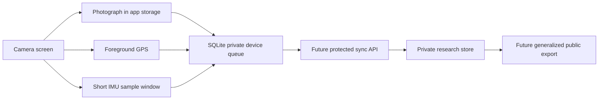

# Architecture

## Mobile Application

The mobile application is deliberately offline-first. A field capture should
remain usable when the device has no mobile signal.



## Source Structure

```text
src/app/                  Expo Router screens
src/components/           Shared UI controls
src/data/                 SQLite initialization and future migrations
src/features/captures/    Capture domain model, persistence and sensor summary
docs/                     Architecture and privacy decisions
```

## Planned Milestones

1. Physical-device field test for camera, GPS and IMU capture.
2. Consent screen and configurable study metadata.
3. Authenticated upload API and encrypted transport.
4. Quality control and duplicate detection.
5. Public export with generalized coordinates and stripped image EXIF data.
6. Optional lightweight on-device turfgrass classifier.
